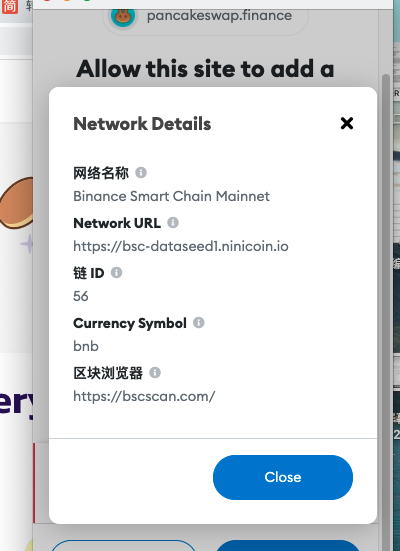

## 钱包接口

### 1.连接到 MetaMask 钱包
检测是否安装？没有安装，去安装  

安装了，链接钱包，获取钱包地址  

参考代码：
https://docs.metamask.io/guide/create-dapp.html#project-setup  

### 2.定义应用程序的图标
当您的站点向 MetaMask 用户发出登录请求时，MetaMask 可能会呈现显示您站点图标的模式。
参考文档：
https://docs.metamask.io/guide/defining-your-icon.html


### 3.连接与断开连接

#### 3.1连接
```javaScript
interface ConnectInfo {
  chainId: string;
}

ethereum.on('connect', handler: (connectInfo: ConnectInfo) => void);
```
当 MetaMask 提供程序首次能够向链提交 RPC 请求时，它会发出此事件。我们建议使用connect事件处理程序和ethereum.isConnected()方法来确定提供程序何时/是否连接。

#### 3.2断开
```javaScript
ethereum.on('disconnect', handler: (error: ProviderRpcError) => void);
```
可以使用该ethereum.isConnected()方法来确定提供程序是否已断开连接。


#### 3.3链改变

```javaScript
ethereum.on('chainChanged', handler: (chainId: string) => void);
```
当当前连接的链发生变化时，MetaMask 提供程序会发出此事件。

所有 RPC 请求都提交到当前连接的链。因此，通过侦听此事件来跟踪当前链 ID 至关重要。

我们强烈建议在链更改时重新加载页面，除非您有充分的理由不这样做。
```javaScript
ethereum.on('chainChanged', (_chainId) => window.location.reload());
```
#### 3.4帐户已更改

```javaScript
ethereum.on('accountsChanged', handler: (accounts: Array<string>) => void);
```

每当eth_accountsRPC 方法的返回值发生更改时，MetaMask 提供程序都会发出此事件。 eth_accounts返回一个空数组或包含单个帐户地址的数组。返回的地址（如果有）是允许调用者访问的最近使用的帐户的地址。调用者由他们的 URL origin标识，这意味着具有相同来源的所有站点共享相同的权限。

这意味着accountsChanged每当用户公开的帐户地址发生变化时都会发出。


### 4.添加自定义RPC网络
Add Network (Custom RPC) using Chainlist in the browser extension
https://metamask.zendesk.com/hc/en-us/articles/360058992772-Add-Network-Custom-RPC-using-Chainlist-in-the-browser-extension
https://chainlist.org/

https://github.com/antonnell/networklist-org/blob/main/components/chain/chain.js

 

```javaScript
const addToNetwork = () => {
    if(!(account && account.address)) {
      stores.dispatcher.dispatch({ type: TRY_CONNECT_WALLET })
      return
    }

    const params = {
      chainId: toHex(chain.chainId), // A 0x-prefixed hexadecimal string
      chainName: chain.name,
      nativeCurrency: {
        name: chain.nativeCurrency.name,
        symbol: chain.nativeCurrency.symbol, // 2-6 characters long
        decimals: chain.nativeCurrency.decimals,
      },
      rpcUrls: chain.rpc,
      blockExplorerUrls: [ ((chain.explorers && chain.explorers.length > 0 && chain.explorers[0].url) ? chain.explorers[0].url : chain.infoURL) ]
    }

    window.web3.eth.getAccounts((error, accounts) => {
      window.ethereum.request({
        method: 'wallet_addEthereumChain',
        params: [params, accounts[0]],
      })
      .then((result) => {
        console.log(result)
      })
      .catch((error) => {
        stores.emitter.emit(ERROR, error.message ? error.message : error)
        console.log(error)
      });
    })
  }
```


### 5.向用户注册token
https://docs.metamask.io/guide/registering-your-token.html


### 6.ethereum.request(args)
https://docs.metamask.io/guide/ethereum-provider.html#methods

```javaScript
interface RequestArguments {
  method: string;
  params?: unknown[] | object;
}

ethereum.request(args: RequestArguments): Promise<unknown>;
```

用于request通过 MetaMask 向以太坊提交 RPC 请求。它返回Promise解析为 RPC 方法调用结果的 。

的params和返回值将RPC方法而变化。在实践中，如果一个方法有任何params，它们几乎总是类型的Array<any>。

如果请求因任何原因失败，Promise 将拒绝并返回 Ethereum RPC Error。

除了一些其他钱包可能不支持的方法之外，MetaMask 还支持大多数标准化的以太坊 RPC 方法。有关详细信息，请参阅 MetaMask RPC API 文档。

例子
```javaScript
params: [
  {
    from: '0xb60e8dd61c5d32be8058bb8eb970870f07233155',
    to: '0xd46e8dd67c5d32be8058bb8eb970870f07244567',
    gas: '0x76c0', // 30400
    gasPrice: '0x9184e72a000', // 10000000000000
    value: '0x9184e72a', // 2441406250
    data:
      '0xd46e8dd67c5d32be8d46e8dd67c5d32be8058bb8eb970870f072445675058bb8eb970870f072445675',
  },
];

ethereum
  .request({
    method: 'eth_sendTransaction',
    params,
  })
  .then((result) => {
    // The result varies by by RPC method.
    // For example, this method will return a transaction hash hexadecimal string on success.
  })
  .catch((error) => {
    // If the request fails, the Promise will reject with an error.
  });

```


### 7.发送交易
https://docs.metamask.io/guide/sending-transactions.html#example

### 8.合约方法
Ethereum JSON-RPC Methods  

For the Ethereum JSON-RPC API, please see the Ethereum wiki (opens new window).  

Important methods from this API include:  

eth_accounts(opens new window)  

eth_call(opens new window)  

eth_getBalance(opens new window)  

eth_sendTransaction(opens new window)  

eth_sign(opens new window)  


> 6.1查询token余额:  

获取代币的余额，要通过rpc接口得到接口为：eth_call  

查看：https://eth.wiki/json-rpc/api   eth_call  

参数  

object字段：  

from: 钱包地址  

to: 代币地址（智能合约地址）  

data：0x70a08231000000000000000000000000b60e8dd61c5d32be8058bb8eb970870f07233155  

data数据格式：最前边的“0x70a08231000000000000000000000000”是固定的，后边的是钱包地址（不带“0x”前缀）  

QUANTITY|TAG，”latest”, “earliest” or “pending”  


//Keccak-256("balanceOf(address)")="0x70a08231b98ef4ca268c9cc3f6b4590e4bfec28280db06bb5d45e689f2a360be"  

//取前4个字节：0x70a08231 

//参考：  

//1.https://www.4byte.directory/signatures/?bytes4_signature=0x70a08231  


String methodId = "0x70a08231";  

data = methodId + "000000000000000000000000" + walletHex;  


> 6.2查询token symbol名称:  

//Keccak-256("symbol()")="0x95d89b41e2f5f391a79ec54e9d87c79d6e777c63e32c28da95b4e9e4a79250ec"  

//取前4个字节：0x95d89b41  

//参考：  

//1.https://www.4byte.directory/signatures/  


>  6.3查询token decimals:

//Keccak-256("decimals()")="0x313ce567add4d438edf58b94ff345d7d38c45b17dfc0f947988d7819dca364f9"  

//取前4个字节：0x313ce567  

//参考：  

//1.https://www.4byte.directory/signatures/  


